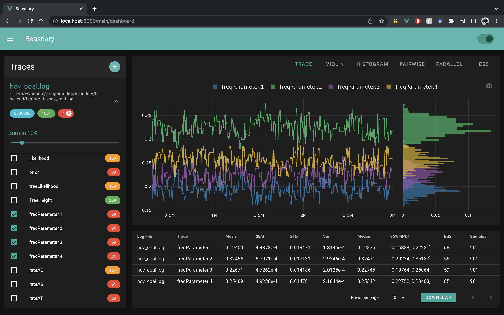

[](https://pypi.org/project/beastiary/)
[](https://github.com/Wytamma/beastiary/actions/workflows/test.yml)
[](https://codecov.io/gh/Wytamma/beastiary)
[](https://beastiary.wytamma.com/)


Beastiary is designed for visualising and analysing MCMC trace files generated from Bayesian phylogenetic analyses. Beastiary works in real-time and on remote servers (e.g. a HPC). The goal of Beastiary is to be a beautiful and simple yet powerful tool for Bayesian phylogenetic inference. A beastiary (from bestiarum vocabulum) is a compendium of beasts.

---

**Paper**: <a href="https://academic.oup.com/mbe/advance-article/doi/10.1093/molbev/msac095/6584747" target="_blank">Wirth & Duchene (2022)</a>

**Documentation**: <a href="https://beastiary.wytamma.com" target="_blank">https://beastiary.wytamma.com</a>

**Source Code**: <a href="https://github.com/Wytamma/beastiary" target="_blank">https://github.com/Wytamma/beastiary</a>

---
## Web version (no installation)
A web version is available at <a href="here" target="_blank">https://sebastianduchene.github.io/beastiary-web</a>. Note that this version does not automatically update log files as the MCMC runs and does not work on a server (no remote inspection). However, it does not require installation of the software, as it runs from your browser. It is useful for inspecting log files on your local machine.

## Install
```bash
pip install beastiary
```

## Use
To start beastiary use the `beastiary` command.

```bash
beastiary
```



For more information read the [docs](https://beastiary.wytamma.com/).

## Cite

> Wytamma Wirth, Sebastian Duchene, Real-Time and Remote MCMC Trace Inspection with Beastiary, Molecular Biology and Evolution, Volume 39, Issue 5, May 2022, msac095, https://doi.org/10.1093/molbev/msac095

