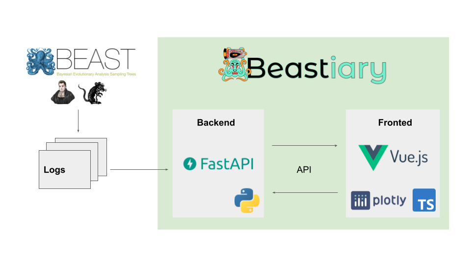

Beastiary is comprised of two parts, the back-end, a web-sever that exposes an Application Programming Interface (API) consumed by the front-end, a single page web-app.

The back-end monitors the log files generated by standard Bayesian phylogenetics software and communicates data to the front end via a web API. Sample data are stored in an in-memory SQLite database. The front-end consumes data from the back-end via the web API and triggers the back-end to check for updates in the log files.

The Beastiary back-end is written in modern Python (version 3.9) and builds on a modern web framework, [FastAPI](https://fastapi.tiangolo.com/). The back-end uses an in memory SQLite database to track log files. Users can specify the path to log files and beastiary will check these files for updates when requested. Beastiary uses caching to save time reading through large log files. Once samples have been read from the log file they are saved to the in-memory SQLite database and therefore any subsequent reads of the same samples are returned from memory. This last step is key to facilitate monitoring analyses that are very time consuming.

The fronted is written in modern JavaScript (Typescript) and is builds on [Vue.js](https://vuejs.org/) for interactivity. The front-end is an interactive single page web-app that allows users to visualise and explore trace data. Once a log file is added the front-end will periodically poll the back-end for new data appended to this log file. The front-end recalculates the effective sample size (ESS) of each trace when new data is returned. This statistic is a useful measure of the number of independent samples from the posterior, where a rule of thumb is to obtain at least 200 for key parameters (Rambaut et al., 2018). A burn-in (default 10%) is applied to all traces. Because the trace is updated in users analysing data in real-time may need to adjust the burn-in depending on the number of samples collected. We see this as a befit as burn-in is often arbitrarily set to 10%, applying a burn-in in real-time forces users to consider an appropriate value for their analysis.

Beastiary provides several plots for visually assessing and exploring data. These plots are implemented using the JavaScript library [Plotly.js](https://plotly.com/javascript/) which can handle thousands of individual points updating in real-time. Ploty.js also enables simple data exploitation such as tool tip generation, trace selection, and plot area zooming. 

## References
Andrew Rambaut, Alexei J Drummond, Dong Xie, Guy Baele, Marc A Suchard, Posterior Summarization in Bayesian Phylogenetics Using Tracer 1.7, Systematic Biology, Volume 67, Issue 5, September 2018, Pages 901–904, https://doi.org/10.1093/sysbio/syy032