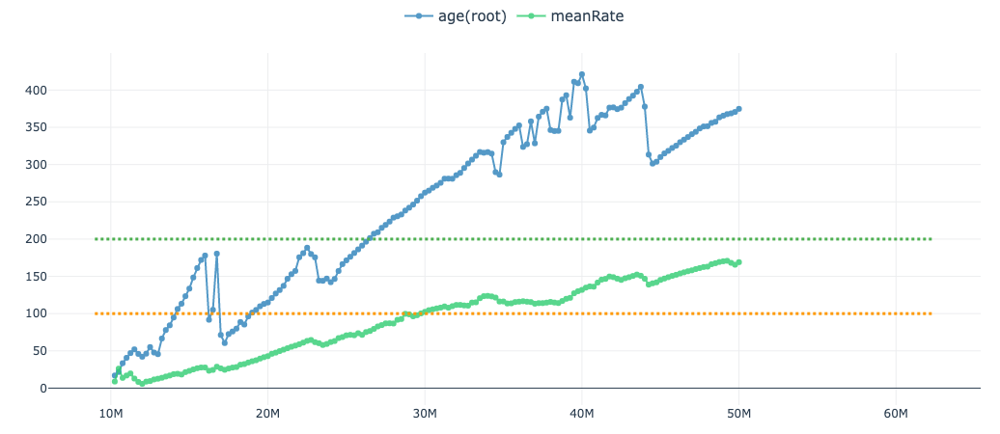

The 'ESS' panel will produce cumulative ESS plots for the selected traces. Cumulative ESS plots are a novel tool that can be used to asses mixing quality and estimate how long a run will take to reach a desired ESS value (Voloch et al., 2012; Vehtarh et al., 2021). These plots are calculated on the fronted so it may take a few moments for the plot to load (depending on the amount of data). 

Each point in the plot above represents the ESS value up to that point (in steps of 100 samples). The 'meanRate' trace has better mixing than the 'age(root)' parameter i.e. the increase in ESS is more linear. However, the overall slope of 'age(root)' is steeper than 'meanRate' and thus reaches the target ESS (200, green dotted line) before 'meanRate' (which will likely reach the target around 55 million steps).

The rate at which ESS increases is dependent on the mixing quality. In particular, the ESS of a well mixing chain should increase linearly with the number of steps (Vehtarh et al., 2021). As a result, the slope of this relationship can be used to estimate how long a run will take to reach a desired ESS value. 

## References
Voloch CM, Schrago CG. Impact of the partitioning scheme on divergence times inferred from Mammalian genomic data sets. Evol Bioinform Online. 2012;8:207-18. doi: 10.4137/EBO.S9627. Epub 2012 May 14. PMID: 22654486; PMCID: PMC3362329.

Aki Vehtari, Andrew Gelman, Daniel Simpson, Bob Carpenter, Paul-Christian Bürkner "Rank-Normalization, Folding, and Localization: An Improved R for Assessing Convergence of MCMC (with Discussion)," Bayesian Analysis, Bayesian Anal. 16(2), 667-718, (June 2021)