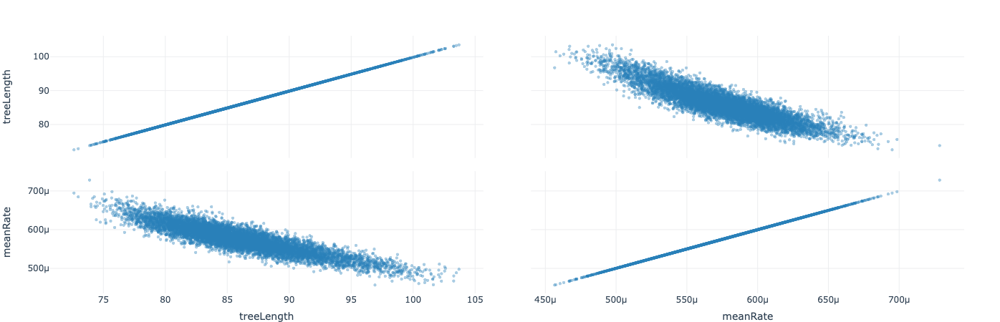

The 'Marginal' panel will produce marginal plots for the selected traces. Marginal plots are useful for finding correlations between the samples.

Here we can see that `meanRate` is negatively corrlated with `treeLength`.