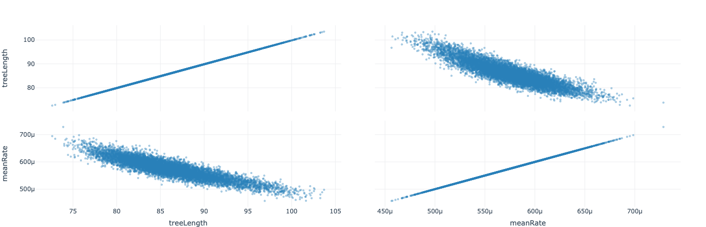

The 'Pairwise' panel will pairwise plots for the selected traces. Pairwise plots are useful for finding correlations between the samples.

Here we can see that `meanRate` is negatively correlated with `treeLength`.