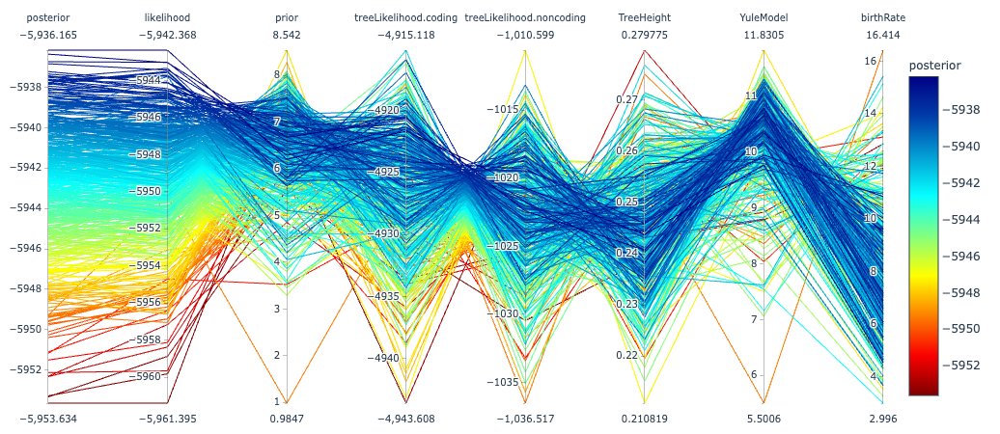

The 'Parallel' panel will produce Parallel coordinates plots for the selected traces. Here, a set of parameters and their values are represented as columns. Each sample is drawn as a line across these parameters. Although parallel coordinates have not been typically used in MCMC trace exploration, we believe they will be useful at elucidating MCMC behaviour and correlation between parameters in MCMC trace, especially in high dimensional models. 

Each y-axis in the plot above shows the values of parameter traces in the analysis and each line corresponds to an MCMC sample. The samples are coloured according to their joint probability (labeled here as 'posterior'). The order of traces along the x-axis is arbitrary and can can be adjusted in Beastiary.

As a case in point, the plot above the posterior and likelihood are strongly positively correlated, as expected when the sequence data are highly informative, resulting in parallel lines, whereas other traces, like the prior, display less correlation. Lines are coloured by the first selected trace, e.g. their joint probability (labeled here as a 'posterior' according to BEAST2 that formally corresponds to an unormalised posterior probability) to facilitate interpretation. 