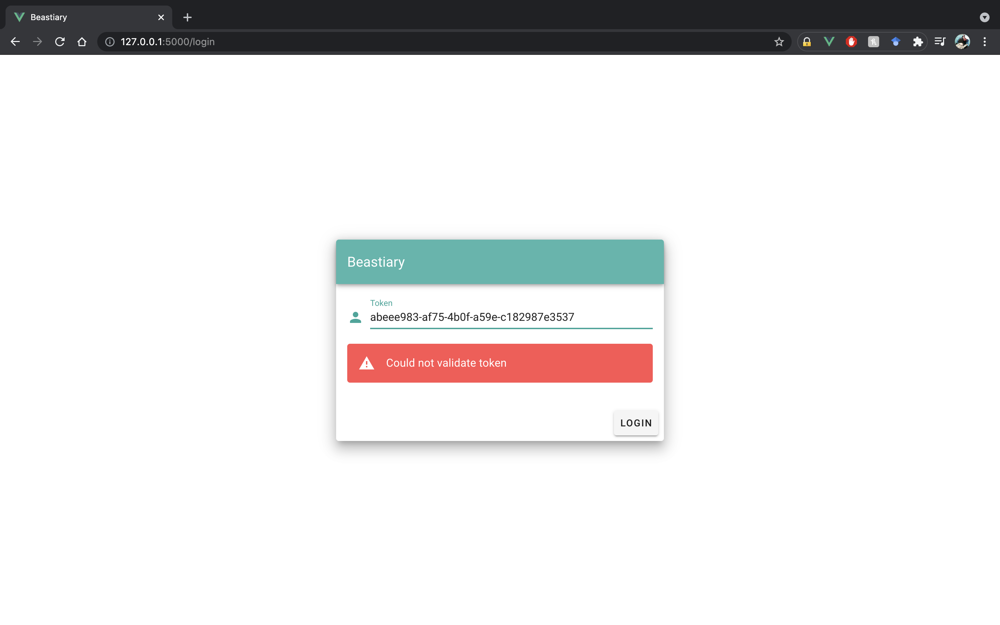
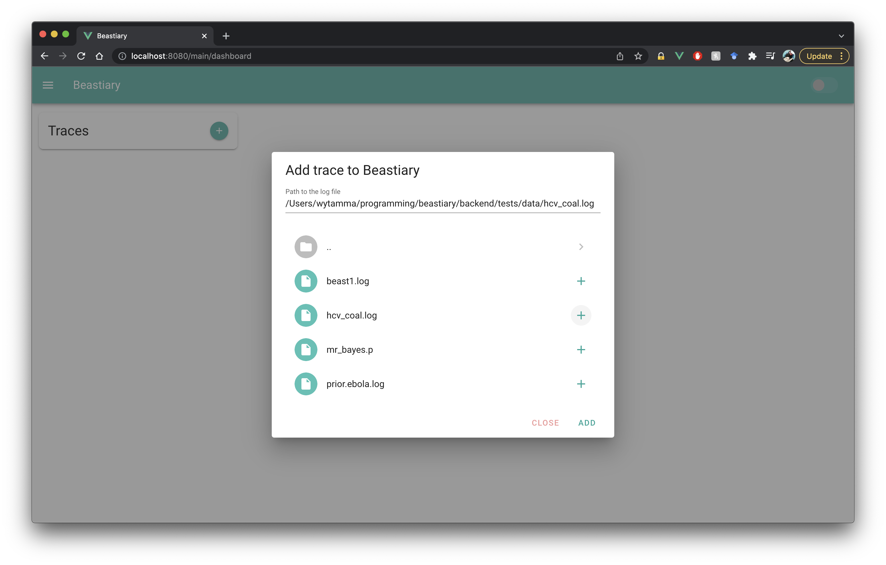
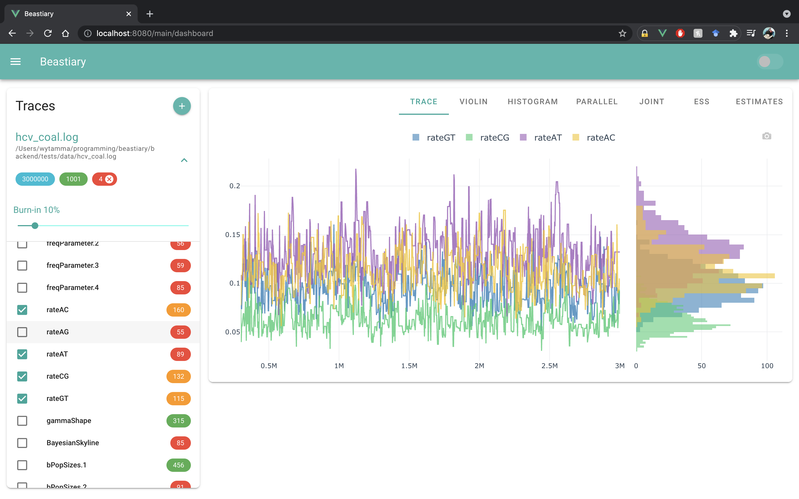

To start beastiary use the `beastiary` command. This will start the beastiary server. 

<div class="termy">

```console
$ beastiary

🐙🐁 <span style="color: blue;">STARTING BEASTIARY</span> 🐁🐙

Go to: <span style="color: green;">http://127.0.0.1:5000/login?token=8e02d06b-d30e-4a89-8476-fb22712a31b3</span>
If prompted enter token: 8e02d06b-d30e-4a89-8476-fb22712a31b3
```

</div>

The server will start on [http://127.0.0.1:5000/](http://127.0.0.1:5000/) by default. Every time the server starts it will generate a unique id that can be used to log into the webapp. 

Go to [http://127.0.0.1:5000/](http://127.0.0.1:5000/) and log in with the ID. 



Add a log file using the `ADD` button. 



Explore the traces of different parameters. 


